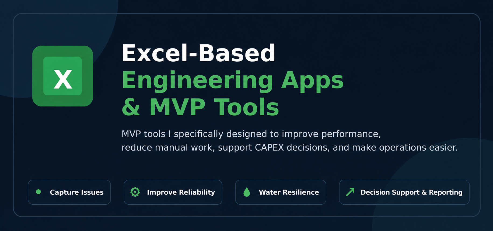
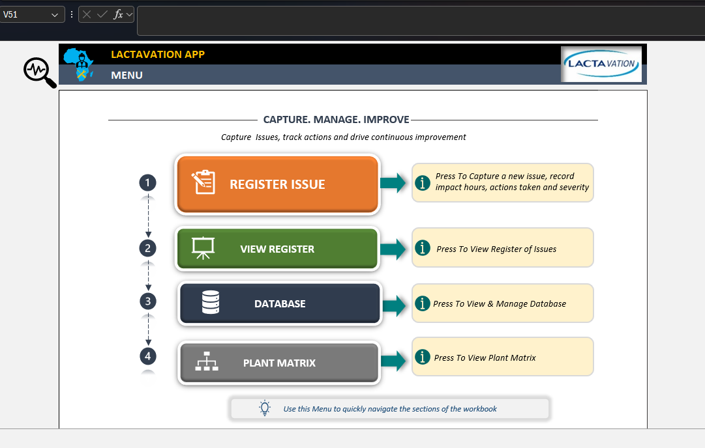
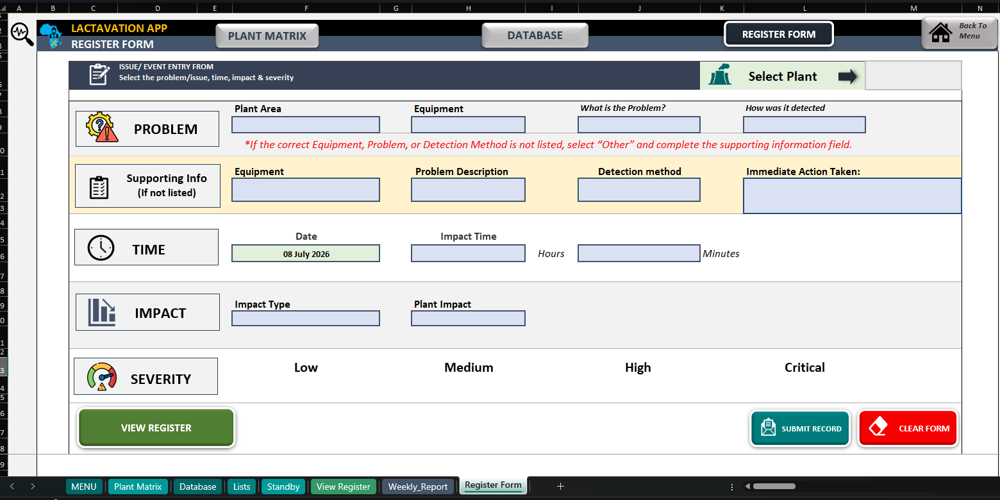
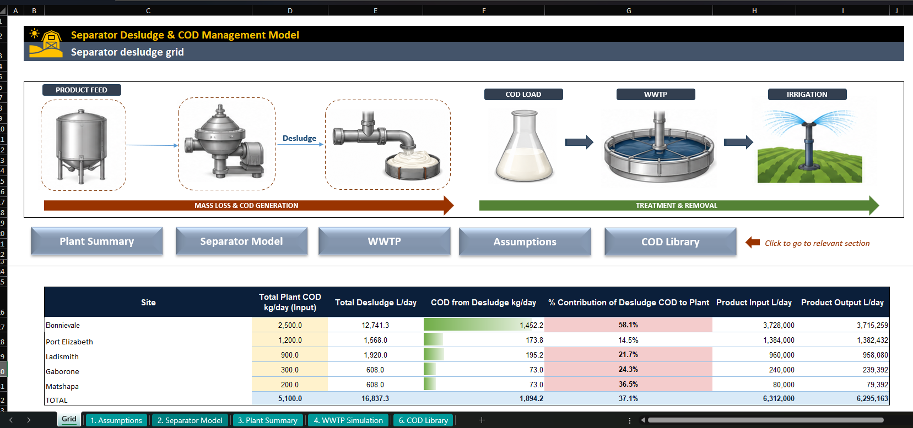
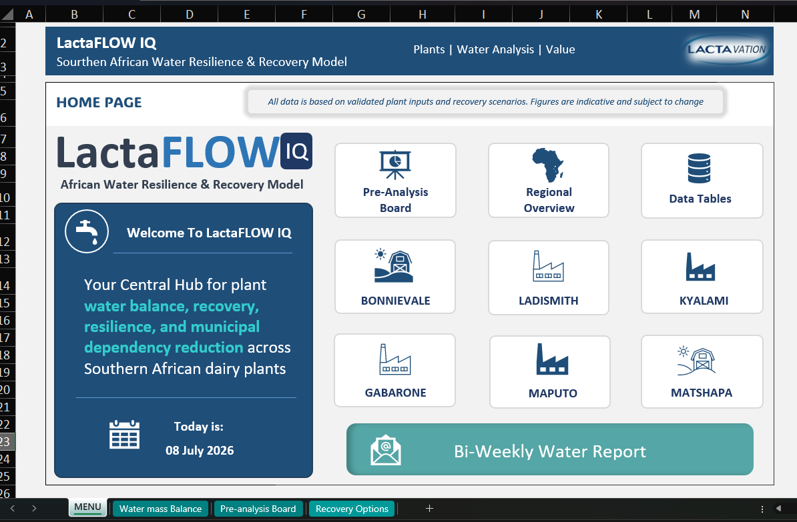

# Excel-Based Engineering Apps & MVP Tools

Practical Excel-based tools that turn plant data into insight, structure and value.

This repository showcases Excel-based engineering apps, MVP tools and operational systems developed to solve real plant challenges across Southern African dairy plants. These tools improve visibility, reduce manual work, support better decisions, and contribute to savings through structured reporting and data-driven follow-up.

---

## 🎯 What This Repository Shows

This portfolio demonstrates that I am not only involved in managing projects, preparing CAPEX submissions and supporting plant improvements. I am also building practical systems that make engineering, operations and project execution easier.

These tools support:

- ✅ Plant issue capture and reliability tracking  
- ✅ Water treatment and water resilience planning  
- ✅ Wastewater and COD impact modelling  
- ✅ CAPEX motivation and project support  
- ✅ Weekly and bi-weekly reporting  
- ✅ Savings identification and loss reduction  
- ✅ Practical MVP development before larger digital systems  

---

# 1. Lactavation App

## Southern African Plant Issue & Reliability Tracking Tool

Lactavation is an Excel-based plant issue tracking and reliability tool designed for Southern African dairy plants.

The tool helps plant teams capture operational issues, record impact hours, track actions, classify severity and create a structured register of plant problems. It supports continuous improvement by making plant issues visible, measurable and easier to follow up.

---

## Key Features

- Daily issue capture  
- Impact hours and severity tracking  
- Structured issue register  
- Plant matrix standardisation  
- Equipment and plant area classification  
- Immediate action tracking  
- Weekly reporting for management review  

---

## Register Form

The register form allows users to capture plant issues in a structured way using controlled fields and dropdowns.

It captures:

- Plant area  
- Equipment  
- Problem type  
- Detection method  
- Supporting information  
- Immediate action taken  
- Date  
- Impact time  
- Impact type  
- Plant impact  
- Severity level  

---

## Value Created

Lactavation contributes value by:

- Reducing scattered manual reporting  
- Creating one standard issue capture process  
- Helping teams understand recurring problems  
- Improving visibility of downtime and plant impact  
- Supporting weekly management reviews  
- Creating a common language across plants  
- Helping identify reliability improvements and potential savings  

---

# 2. Separator Desludge & COD Management Model

## Milk Desludge Loss and Wastewater Impact Simulation Tool

This Excel-based model estimates separator desludge volumes, product loss and COD contribution to the wastewater treatment plant.

It was developed to help understand how separator desludging contributes to mass loss, COD generation and wastewater load. The model provides a simple way to estimate input, output, product loss and potential WWTP impact across multiple sites.

---

## Key Features

- Separator desludge volume estimation  
- Product input and output balance  
- COD load estimation  
- Desludge contribution to total plant COD  
- Site comparison summary  
- WWTP impact simulation  
- COD library for assumptions and reference values  

---

## Value Created

This model supports:

- Product loss visibility  
- COD load estimation  
- Wastewater impact discussions  
- Technical motivation for process improvement  
- Better understanding of separator losses  
- Site comparison and prioritisation  
- Future CAPEX or operational improvement motivation  

---

# 3. LactaFLOW IQ

## Southern African Water Resilience & Recovery Model

LactaFLOW IQ is an Excel-based water resilience and recovery model designed to support water balance, recovery opportunity identification and municipal dependency reduction across Southern African dairy plants.

The tool provides a central hub for plant water analysis, pre-analysis, recovery options and site-specific water improvement work.

---

## Key Features

- Water mass balance  
- Recovery opportunity tracking  
- Municipal dependency reduction  
- Plant-level water resilience views  
- Regional overview  
- Data tables  
- Pre-analysis board  
- Bi-weekly water reporting  

---

## Value Created

LactaFLOW IQ supports:

- Better understanding of plant water use  
- Identification of recovery opportunities  
- Reduction of municipal water dependency  
- Improved reporting on water resilience  
- Better project justification for water-related CAPEX  
- Regional comparison across plants  
- Practical water reliability planning  

---

# Repository Focus Areas

This repository focuses on Excel-based MVP tools in the following areas:

- Plant reliability  
- Water treatment  
- Wastewater treatment  
- Water recovery  
- CAPEX support  
- Engineering reporting  
- Operational dashboards  
- Issue tracking  
- Loss reduction  
- Savings identification  
- Process improvement  
- Project management visibility  
- Stakeholder reporting  

---

# Tools & Methods Used

- Microsoft Excel  
- Excel VBA  
- Power Query  
- Form-based data capture  
- Dashboard design  
- KPI cards  
- Dropdown-driven registers  
- Structured databases  
- Automated reporting logic  
- PDF report outputs  
- Engineering calculations  
- Process flow mapping  
- Scenario modelling  
- Mass balance logic  

---

# What These Tools Demonstrate

These tools demonstrate my ability to combine engineering, operations and data into practical systems that can be used by real plant teams.

They show experience in:

- Understanding plant problems  
- Translating operational needs into usable tools  
- Building MVP systems quickly  
- Structuring data capture  
- Improving reporting discipline  
- Supporting decision-making with dashboards  
- Creating tools that are visually clear and practical  
- Linking engineering work to savings, reliability and CAPEX motivation  

---

# Portfolio Direction

This repository forms part of my broader direction toward data-driven project management and engineering execution.

As AI continues to change the technical landscape, I believe engineers must continue developing strong technical skills while also strengthening project leadership, stakeholder management, communication, business case development and execution discipline.

These tools reflect that direction. They are not just spreadsheets. They are practical engineering systems designed to improve visibility, support decisions, reduce manual effort and help teams execute better.

---

# Current Development Focus

The current development focus includes:

- Improving Lactavation reporting across plants  
- Building stronger weekly and monthly reporting outputs  
- Expanding water reliability models  
- Improving wastewater and COD simulation logic  
- Linking plant issue data to savings opportunities  
- Building CAPEX-ready dashboards and summaries  
- Creating tools that can later evolve into more formal digital systems  

---

## 💡 Guiding Statement

> Built to make plant teams’ lives easier, decisions smarter and operations more reliable.

---

# Thank You

Thank you for viewing this repository.
